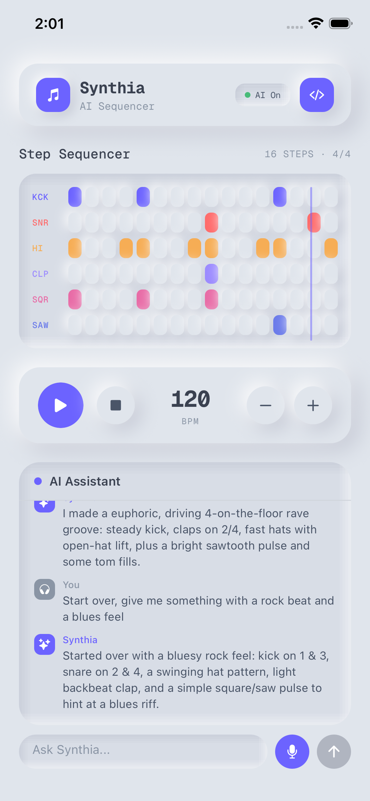

# Music Companion

A mobile "metronome on steroids" — type natural language like "Give me a rock beat" and get instant audio with a visual step sequencer. Built with Expo, Tambo AI, and Strudel.

<p align="center">
  
</p>

## Stack

- **Expo SDK 55** / React Native 0.83
- **Tambo AI** — natural language to tool calls
- **Strudel** (`@strudel/core` + `@strudel/mini`) — music pattern engine
- **react-native-audio-api** — native audio synthesis
- **Reanimated** — 60fps playback cursor

## Prerequisites

- Node.js 18+
- Xcode 26+ (for iOS simulator)
- CocoaPods (`brew install cocoapods` if needed)

## Setup

```bash
# Install dependencies
npm install --legacy-peer-deps

# Add your Tambo API key
cp .env.example .env
# Edit .env and set EXPO_PUBLIC_TAMBO_API_KEY=your_key_here

# Build and run on iOS simulator
npx expo run:ios
```

## Usage

Type a prompt in the chat bar at the bottom:

- "Give me a rock beat"
- "Add a hihat pattern"
- "Make it funkier"
- "Remove the snare"

The AI generates Strudel mini-notation patterns, which drive the synthesizer and update the sequencer grid in real time.

## Project Structure

```
app/                    # Expo Router screens
  _layout.tsx           # Root layout (providers)
  index.tsx             # Main screen
components/             # UI components
  sequencer-grid.tsx    # Step sequencer with animated cursor
  grid-row.tsx / grid-cell.tsx
  transport-bar.tsx     # Play/Stop + BPM
  chat-drawer.tsx       # Bottom sheet chat
  input-bar.tsx         # Text input
lib/
  strudel/
    engine.ts           # Pattern evaluation via mini()
    scheduler.ts        # Two-clocks audio scheduler
    audio-output.ts     # Drum + oscillator synthesis
    pattern-to-grid.ts  # Pattern -> grid visualization
  providers/
    strudel-provider.tsx # React context for audio state
  tambo/
    tools.ts            # update_pattern tool definition
    system-prompt.ts    # AI instructions + examples
  polyfills.ts          # RN runtime polyfills
plugins/
  xcode26-workaround.js # Auto-patches Podfile for Xcode 26
```

## Notes

- Audio is synthesized on-device (no sample loading). Kick, snare, hihat, clap, rimshot, and tom each have distinct synthesis.
- The `--legacy-peer-deps` flag is needed due to peer dependency conflicts between some packages.
- The Xcode 26 workaround plugin automatically disables Swift explicit modules during `expo prebuild`.
